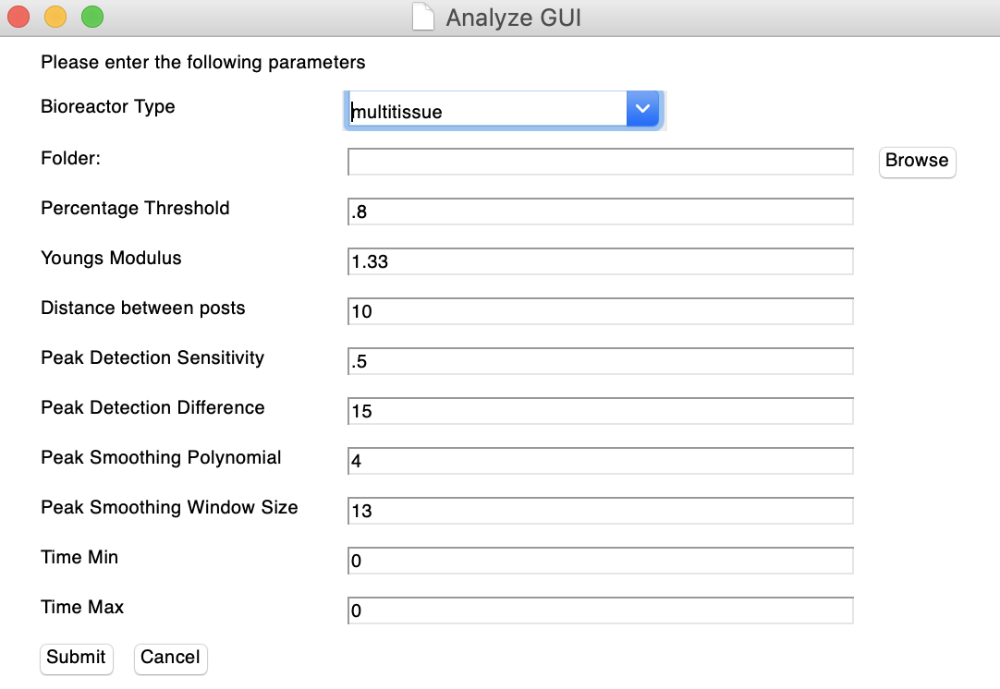

  

  <strong>M-Tee-Tee: Multi-Tissue-Tracker</strong>

 

  This is a program designed to track n sets of defecting posts and perform a series of calculations to understand that motion. It is written in python and reies on opencv trackers. 
   
   
  Instructions below are for MacOS.  
  For linux the SetupScript and M-Tee-Tee launcher will not work but using terminal will.  
   
  For Windows I have no idea. 

  

___
> [Setup](#setup) - [Updates](#updates) - [Usage](#usage) - [Tracking](#tracking) - [Analysis](#analysis)  

___

# Setup:

1. Make sure to have python 3 installed.
[https://www.python.org/downloads/](https://www.python.org/downloads/)

2. Go to [https://www.github.com/Jack-alope/MTeeTee/releases](https://www.github.com/Jack-alope/MTeeTee/releases) and download the zip of the latest realease. If on macOS 10.12 or higher download v0.0.x while if on macOS 10.11 download v0.0.x-oldmac.  
- v0.0.x uses the latest version of opencv
- v0.0.x-oldmac uses opencv version 3.4.2.16  

3. Download the "M-Tee-Tee.zip" not the source code. 

4. Unzip the file and drage "M-Tee-Tee" to the applications folder, it is then ready to be launched. 

# Updates:

1. Download the latest zip file for your OS. 

2. Remove the old "MTeeTee" application in the applications folder and replace with the new one just downloaded. Make sure the new one is named "M-Tee-Tee"

# Usage:

1. Double click "M-Tee-Tee" to launch the program. 

2. The first screen will be the startupGUI. 
You have two choices.
- Choose "track" to launch the tracking part of this program and generate data.  
- Choose "analyze" if you have already produced data for the deflections you want and are ready to analyze. 
  

## Tracking:

Upon selecting "track" from the startupGUI this screen will appear. 
- Video path: Select browse and navigate to the video file you want to track.
- Save to: Select or create a folder in which you want the generated data to be saved to.
- First Tissue: The first tissue number you are going to track in this video. 
- Last Tissue: The last tissue you will select. Note, tissue in video must be in consecutive order. Or files renamed after. 
- Pacing Frequency: The frequency at which the tissues were paced. Note, for spontaneous the standard is 0.1
- Electrode Spacing**: Not Currently Used
- Excitation Threshold**: Not Currently Used
- Calibration Distance: The distance of the object you are going to calibrate too. 
- Frame Width: The size of the video frame to be displayed.
- Group Name**: Currently being worked on. 
- Group Number**: Currently being worked on. 
- Tracker: Which type of opencv tracker would you like to use. csrt gives best results while kcf is the fastest. 
  
1. Once you submit a frame will pop, this is a 6 tissue example. 
 
2. Immediately press 'c' and draw a calibration line the length that you inputted in the GUI. Press enter. 
 
3. Press 'l'. Draw cross section for first tissue. 
 
Press enter. Repeat for each tissue (Don't press 'l' again, just draw line and enter.)    
4. Press 's'. Draw a box around the first post. 
 
Press enter. 
5. Draw a box around the second post.
 
Press enter. Repeat steps 4 and 5 for each tissue (Don't press 's' again, just draw boxes and hit enter.)  
6. This is what it should look like when posts are being tracked. If no green boxes are displayed you didnt select the posts. 
 
7. The data will be saved to the folder you specified. A csv and txt file are being produced for each tissue. 

## Analysis:

Upon selecting "analyze" this screen will appear. 
- Bioreactor Type: Determines what information is needed for post and tissue height
  - If "eht" no height file is required as post and tissue heights are constant and already known. 
  - If "multitissue" a Heights.csv file will need to be provided, an example will be in this repository. 
- Folder: The folder that you previously generated is. This is also where the heightfile would be saved to. 
- Percentage Threshold**: Increase this if basepoint or endpoint is too high (Between 0-1)
- Post Radius: Will Be deleted, based on bioreactor type. 
- Youngs modulus: For the mold material, standard 1.33 MPa.
- Distance between posts**: How far away are the posts from each other. 
- Peak Setection Sens: The lower the number the more sensitive (Between 0-1).
- Peak Detection Diff: Minimum distance peaks can be from each other. 
- Peak Smoothing Poly: What degree polynomial should it use to smooth the data, higher is smoother but can lose accuracy. 
- Peak Smoothing window: What size window should it use for the smoothing function. Larger is smoother. 
- Time min: Start time. Use 0 to start from beginning. 
- Time max: End Time. Use 0 to continue to end. 
 
When submitted it should produce a graph like this for each tissue. (Zoom will vary depending on number of points).
 
If you do not agree with the graph edit the settings in the GUI until you get it to capture the points to your liking.  
In the selected folder a summary.csv file is added with all of the calulcations. 

** Will be modified or deleted. 

